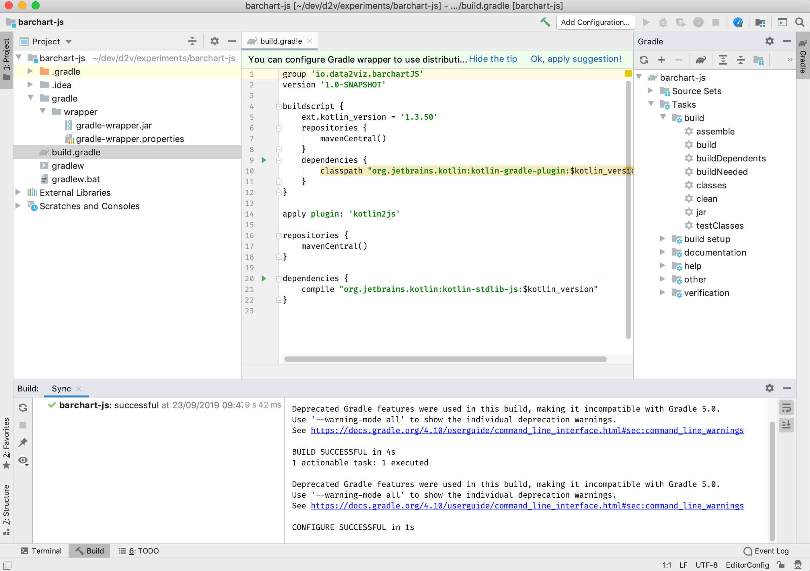
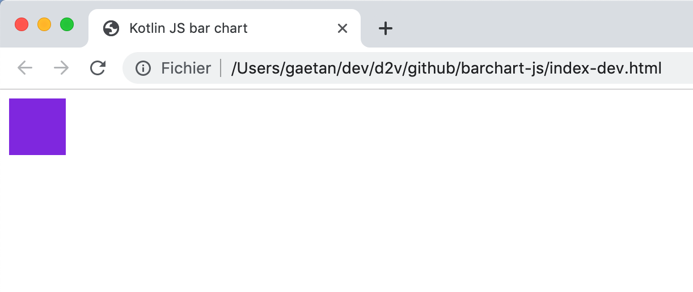
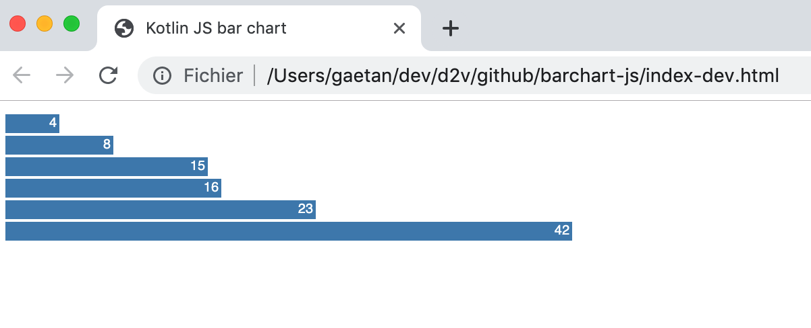
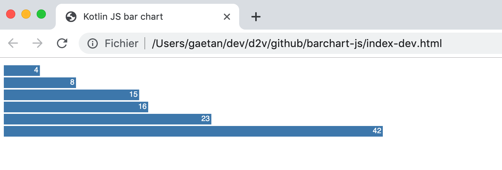

# Let's make a Kotlin/JS bar chart

This tutorial is a step-by-step guide that explains how to 
create a Kotlin/JS project that displays a bar chart inside 
an HTML page *(this tutorial has been tested on IntelliJIdea community edition 2019.2.2).*


>This tutorial is data2viz version of [D3JS Let’s Make a Bar Chart](https://bost.ocks.org/mike/bar/).


This tutorial will help you understand how to:

1. set the gradle build for a data2viz JavaScript project,
1. wrap a viz inside an HTML page,
1. use basic visual components like rectangle, text, colors, group.
1. introduce `Scale` functions.


## Creating the Kotlin/JS project

For this target, we start by creating a directory named `barchart-js` and a `build.gradle` 
file in it, containing the following lines.

```groovy
plugins {
    id 'org.jetbrains.kotlin.js' version '1.3.61'
}

group 'io.data2viz.barchartJS'
version '1.0-SNAPSHOT'

repositories {
    jcenter()
    mavenCentral()
}

dependencies {
    implementation "org.jetbrains.kotlin:kotlin-stdlib-js"
}

kotlin {
    target {
        browser {}
    }
}
```

We then open the file from IntellijIdea, and choose "Open as a project".


IntellijIdea creates the project, synchronizes the Gradle project and download libraries.




Then, we create the source directory `src/main/kotlin` with a first `MainJS` file in it, 
to validate the configuration.

```kotlin
fun main() {
    println("Hello Kotlin/JS")
}
```

We launch the build frow the Gradle tool window by double-clicking on the` build` task.

Gradle creates a build directory. The `kotlin.js` plugin transpiles Kotlin 
code into javascript using defaults options. 

We create an `index.html` file in the `src/main/kotlin` directory. We add a link to the transpiled 
file.

```html
<!DOCTYPE html>
<html>
<body>
<script src="barchart-js.js"></script>
</body>
</html>
```

To compile and launch the page, we just need to start the `browserRun` Gradle task.
It automatically start the browser with the index page. We can see our message in the console.


## Add a visualization

It's time now to start data2viz code. First, we have to add some 
dependencies on data2viz library in `gradle.build` file:

```groovy
dependencies {
    implementation "org.jetbrains.kotlin:kotlin-stdlib-js"
    implementation "io.data2viz.d2v:core-js:0.8.0-RC9"
    implementation "io.data2viz.d2v:color-js:0.8.0-RC9"
    implementation "io.data2viz.d2v:scale-js:0.8.0-RC9"
    implementation "io.data2viz.d2v:viz-js:0.8.0-RC9"
}
}
```


Let's change the code to include a visualization.

```kotlin
import io.data2viz.color.Colors
import io.data2viz.geom.size
import io.data2viz.viz.bindRendererOn
import io.data2viz.viz.viz

const val vizSize = 500.0

fun main() {
    println("Hello Kotlin/JS")
    val viz = viz {
    
        size = size(vizSize, vizSize)

        rect {
            size = size(50.0, 50.0)
            fill = Colors.Web.blueviolet
        }
    }
    viz.bindRendererOn("viz")           //<- select a canvas with this id to install the viz 
}
```

We also change the body of the HTML file to introduce a canvas.

```html
<!DOCTYPE html>
<html>
<body>
<canvas id="viz"></canvas>     <!--the id selected for viz binding -->
<script src="barchart-js.js"></script>
</body>
</html>
```

After building and reloading the page, we now have this basic rendering.



## Displaying data as a bars

So let's say we have this data defined as a global value:

```kotlin
val data = listOf(4, 8, 15, 16, 23, 42)
```

We define a few constants:

```kotlin
const val vizSize = 500.0
const val barHeight = 14.0
const val padding = 2.0
```

We are now iterating on the data using index to create a rectangle
for each of it and adding a text representing its value.

```kotlin
val viz = viz {

    size = size(vizSize, vizSize)

    data.forEachIndexed { index, datum ->
        group {
            transform {
                translate(
                    x = padding,
                    y = padding + index * (padding + barHeight) )
            }
            rect {
                width = 10.0 * datum
                height = barHeight
                fill = Colors.Web.steelblue
            }
            text {
                textContent = datum.toString()
                hAlign = TextHAlign.RIGHT
                vAlign = TextVAlign.HANGING
                x = datum * 10.0 - padding
                y = 1.5
                textColor = Colors.Web.white
                fontSize = 10.0
            }
        }
    }
}
```

We use a group to add a translation for each value, adding a `x` padding and moving 
on the `y` from the height of the bar plus a padding.

It produces the following result:



In this first version, we used a fixed ratio of 10.0 to define the width of the bar. 
It was ok, because we knew the max value of data and 10.0 * maxValue was still inside
the viz bounds. But, we can do better to have an automatic scaling without knowing
data.

For that, we introduce a `Scale` that will manage the ratio to keep the bars exactly
in the bounds of the viz:

```kotlin
val data = listOf(4, 8, 15, 16, 23, 42)

val xScale = Scales.Continuous.linear {
    domain = listOf(.0, data.max()!!.toDouble())
    range = listOf(.0, width- 2* padding)
}
```

This code creates a `Scale` that maps the domain values [0..42] to the wanted widths [0.0 .. 496.0].
We can use this scale in the visualization code to set the expected width of the bar, and position 
of the text:

````kotlin
val viz = viz {
    data.forEachIndexed { index, datum ->
        group {
            transform {
                translate(
                    x = padding,
                    y = padding + index * (padding + barHeight) )
            }
            rect {
                width = xScale(datum)           //<- now width is calculate from scale
                height = barHeight
                fill = Colors.Web.steelblue
            }
            text {
                textContent = datum.toString()
                hAlign = TextHAlign.RIGHT
                vAlign = TextVAlign.HANGING
                x = xScale(datum) - 2.0         //<- also text positioning
                y = 1.5
                textColor = Colors.Web.white
                fontSize = 10.0
            }
        }
    }
}
````


Great, you now know how to create a data2viz project in a KotlinJS application. 

You can find the complete code of this project on 
[our data2viz examples repository](https://github.com/data2viz/data2viz-examples/blob/master/tutorials/barchart-js/).


If you have any suggestion, request, or feedback, please feel free 
to post a comment [on the forum](https://forum.data2viz.io/t/data2viz-documentation/96)
 or create a pull request on this project.
