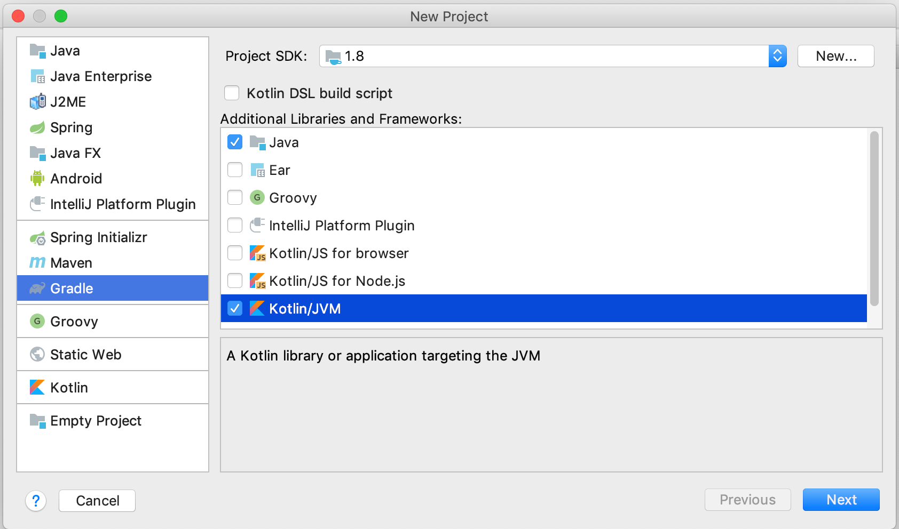

# Let's make a JFx Barchart

In this first tutorial, we'll use data2viz to display a bar chart 
in a JavaFX application. 

>This tutorial is data2viz version of [D3JS original version](https://bost.ocks.org/mike/bar/).

This tutorial will help you understand how to:

1. set the gradle build for a data2viz JavaFX project,
1. wrap a viz inside a JavaFX application,
1. use basic visual components like rectangle, text, colors, axis.

## Creating a new project

From intellij idea, we create a new project using Gradle Kotlin/JVM wizard.

We keep the defaults options and use Java 8. Later versions of Java don't 
include JavaFX. It needs some more configuration steps that are outside of 
the scope of this tutorial.

We define the location of new project

Depending on your environment, IntelliJ may then load the version of gradle configured 
in the `gradle/wrapper/gradle-wrapper.properties` file. 

We then create a first `Main.kt` file with a main function to validate 
that the configuration is ok. Launching by clicking on the green triangle 
on the left gutter of the editor should build and start this first program.

