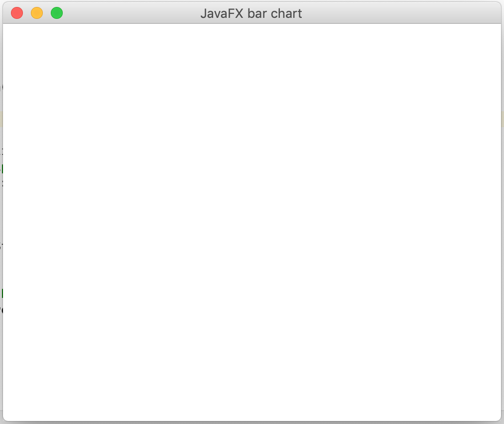
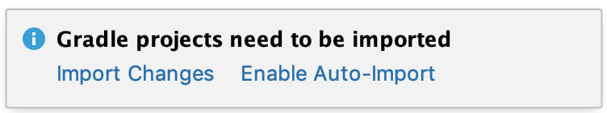
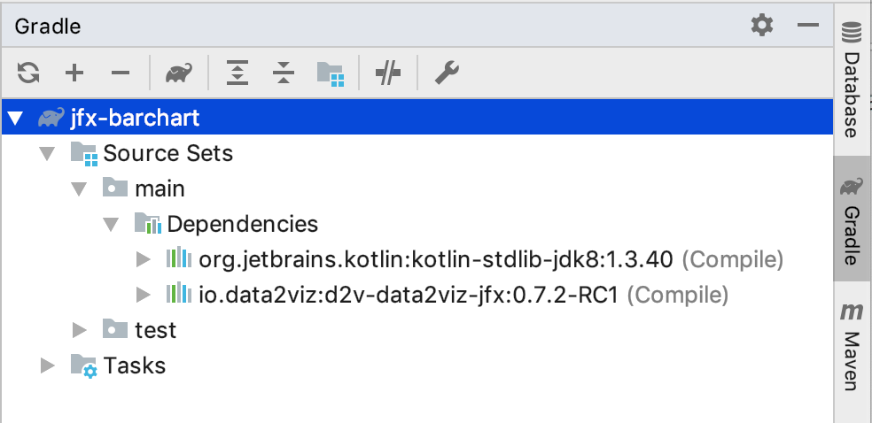
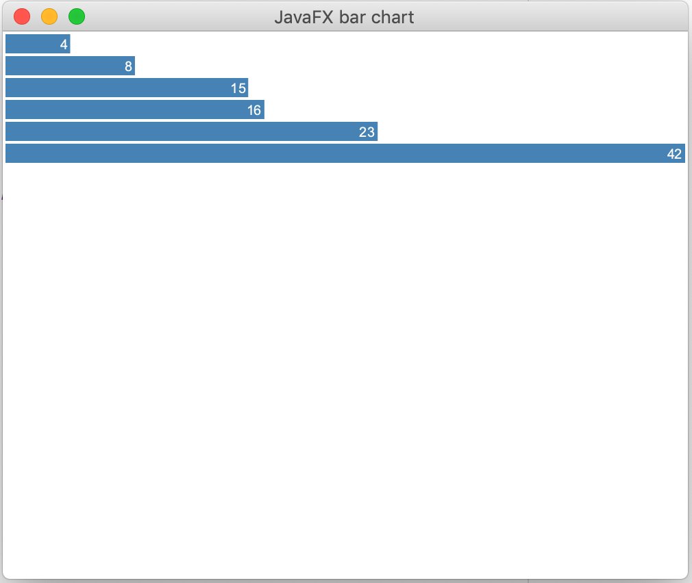

# Let's make a JavaFX    Barchart

In this first tutorial, we'll use data2viz to display a bar chart 
in a JavaFX application. 

>This tutorial is data2viz version of [D3JS original version](https://bost.ocks.org/mike/bar/).


This tutorial will help you understand how to:

1. set the gradle build for a data2viz JavaFX project,
1. wrap a viz inside a JavaFX application,
1. use basic visual components like rectangle, text, colors, group.
1. introduce `Scale` functions.


## Creating a new project

From intellij idea, we create a new project using Gradle Kotlin/JVM wizard.


We keep the defaults options and use Java 8. Later versions of Java don't 
include JavaFX. It needs some more configuration steps that are outside of 
the scope of this tutorial.


We define the location of new project


Depending on your environment, IntelliJ may then load the version of gradle configured 
in the `gradle/wrapper/gradle-wrapper.properties` file. 

We then create a first `Main.kt` file with a main function to validate 
that the configuration is ok. Launching by clicking on the green triangle 
on the left gutter of the editor should build and start this first program.


## Start a JavaFx application


Now, we create a JavaFX application that will handle the bar chart. 
Let's change the code of `Main.kt`:

```kotlin
import javafx.application.Application
import javafx.scene.Group
import javafx.scene.Scene
import javafx.stage.Stage

const val width = 500.0
const val height = 400.0

class BarChartJFX : Application() {

    companion object {
        @JvmStatic
        fun main(args: Array<String>) {
            println("Starting application")
            launch(BarChartJFX::class.java)
        }
    }

    override fun start(stage: Stage?) {
        val root = Group()
        stage?.let {
            it.title = "JavaFX bar chart"
            it.scene = Scene(root, width, height)
            it.show()
        }
    }

}
```


Nothing fancy here, just an empty JavaFX application using 
some width and height.

Again, we can launch the application by clicking on the launch icon.



## Add a visualization

It's time now to start data2viz code. First, we have to add a 
dependency on data2viz library in `gradle.build` file:

```groovy
dependencies {
    implementation "org.jetbrains.kotlin:kotlin-stdlib-jdk8"
    implementation "io.data2viz:d2v-data2viz-jfx:0.7.2-RC1"
}
```

IntellijIdea proposes to `Import Changes`, and we accept it by 
clicking on the link. 



The library is then automatically downloaded. We have the 
confirmation by opening the Gradle tool window.



Now, we can add `data2viz` code. Let's change the `start` function:

```kotlin
override fun start(stage: Stage?) {
    val root = Group()
    stage?.let {
        it.title = "JavaFX bar chart"
        it.scene = Scene(root, width, height)
        val canvas = Canvas(width, height)
        root.children.add(canvas)
        val viz = viz {
            rect {
                width = 50.0
                height = 50.0
                fill = Colors.Web.blueviolet
            }
        }
        JFxVizRenderer(canvas, viz)
        viz.render()

        it.show()
    }
}
```

Launching the application, we have this result:


Kudos, we have our first visualization! But how it's 
working, what did we do? 

First, we add a JavaFX `Canvas` to the component tree:
```kotlin
        val canvas = Canvas(width, height)
        root.children.add(canvas)
```
`data2viz` draws a memory visualization on a canvas. 
We need that canvas in the targeted platform. 

We then have defined the visualization. We create it 
by calling the `viz` function. 

This function takes a lambda that starts the data2viz 
DSL. Inside this lambda, we have access to available 
functions of `viz`. `rect` is a function call that 
creates a rectangle and takes a rectangle configuration 
lambda that allow us to define the properties of this 
rectangle: its width, height and fill color.

We, then, bind this visualization to the canvas by 
creating a JfxVizRender: `JFxVizRenderer(canvas, viz)`.

The last call, `viz.render()` draws the viz on the canvas.

## Displaying data as a bars

So let's say we have this data defined as a global value:

```kotlin
val data = listOf(4, 8, 15, 16, 23, 42)
```

We define two more constants:

```kotlin
const val barHeight = 14.0
const val padding = 2.0
```

We are now iterating on the data using index to create a rectangle
for each of it and adding a text representing its value.

```kotlin
val viz = viz {
    data.forEachIndexed { index, datum ->
        group {
            transform {
                translate(
                    x = padding,
                    y = padding + index * (padding + barHeight) )
            }
            rect {
                width = 10.0 * datum
                height = barHeight
                fill = Colors.Web.steelblue
            }
            text {
                textContent = datum.toString()
                hAlign = TextHAlign.RIGHT
                vAlign = TextVAlign.HANGING
                x = datum * 10.0 - padding
                y = 1.5
                textColor = Colors.Web.white
                fontSize = 10.0
            }
        }
    }
}
```

We use a group to add a translation for each value, adding a `x` padding and moving 
on the `y` from the height of the bar plus a padding.

It produces the following result:


In this first version, we used a fixed ratio of 10.0 to define the width of the bar. 
It was ok, because we knew the max value of data and 10.0 * maxValue was still inside
the viz bounds. But, we can do better to have an automatic scaling without knowing
data.

For that, we introduce a `Scale` that will manage the ratio to keep the bars exactly
in the bounds of the viz:

```kotlin
val data = listOf(4, 8, 15, 16, 23, 42)

val xScale = Scales.Continuous.linear {
    domain = listOf(.0, data.max()!!.toDouble())
    range = listOf(.0, width- 2* padding)
}
```

This code creates a `Scale` that maps the domain values [0..42] to the wanted widths [0.0 .. 496.0].
We can use this scale in the visualization code to set the expected width of the bar, and position 
of the text:

````kotlin
val viz = viz {
    data.forEachIndexed { index, datum ->
        group {
            transform {
                translate(
                    x = padding,
                    y = padding + index * (padding + barHeight) )
            }
            rect {
                width = xScale(datum)
                height = barHeight
                fill = Colors.Web.steelblue
            }
            text {
                textContent = datum.toString()
                hAlign = TextHAlign.RIGHT
                vAlign = TextVAlign.HANGING
                x = xScale(datum) - 2.0
                y = 1.5
                textColor = Colors.Web.white
                fontSize = 10.0
            }
        }
    }
}
````


Great, you now know how to create a data2viz project in a JavaFX application. 
It's an essential first step because it's the most comfortable 
environment to test and debug data visualization.

If you have any suggestion, request, or feedback, please feel free 
to post a comment [on the forum](https://forum.data2viz.io/t/data2viz-documentation/96)
 or create a pull request on this project.
